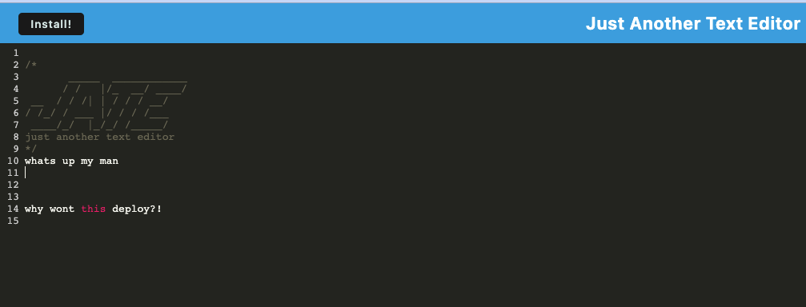

# Text-Editor
  ## Description
  An application that runs offline as a single page layout, it can be used offline. Users can store their notes on a page refresh, it is stored in a database. 
  ## Table of Contents
  - [Installation](#installation)
  - [Usage](#usage)
  - [Contributing](#contributing)
  - [Tests](#tests)
  - [Questions](#questions)
  
  
  ## Installation 
  Run npm i in each folder with a json file to install dependencies for back-end.
  ## Usage 
  Store your notes online and never lose your notes. You can come back at any point if the app closed and pick up where you left off. 
  ## Contributing 
  Luke Stewart
  ## Tests 
  None
  ## Questions
  ### GitHub
  [GitHub](https://www.github.com/L-Stew206) 
  ### Email
  luketheforce206@gmail.com
  ## Screen Shots
   
  ## Link
  link https://text-editor-101.herokuapp.com/ 
  ##
  
  [This application is licens